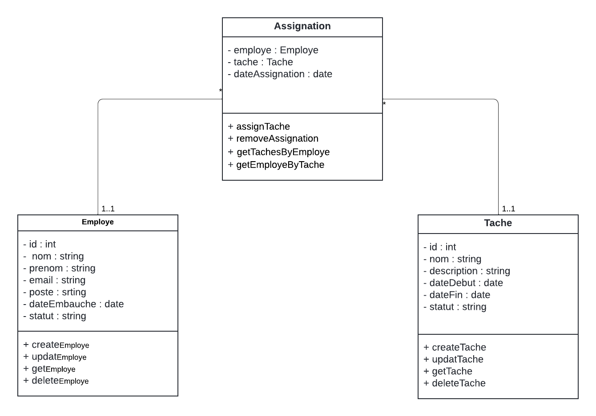

# Projet de Gestion de Projet

Ce projet est une application de gestion de projet utilisant Node.js, Express, et des modules personnalisés pour gérer les employés, les tâches, et les assignations.


## Prérequis

- Node.js

## Installation

Clonez le projet et installez les dépendances :

```bash
git clone https://github.com/AbderahmaneThimbo/gestion-de-projet.git
cd gestion-de-projet
npm install
```

## Démarrer le projet

```bash
npm start
```

## UML

